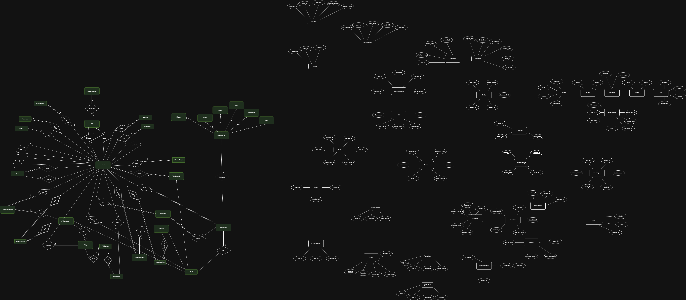

# telegram-database
A relational database design for a Telegram-like messaging platform, including an ER diagram, logical schema, and SQL implementation using CockroachDB. Features user authentication, messages, chats, channels, bots, and storage management. 

Here is the ER diagram for the Telegram database:

